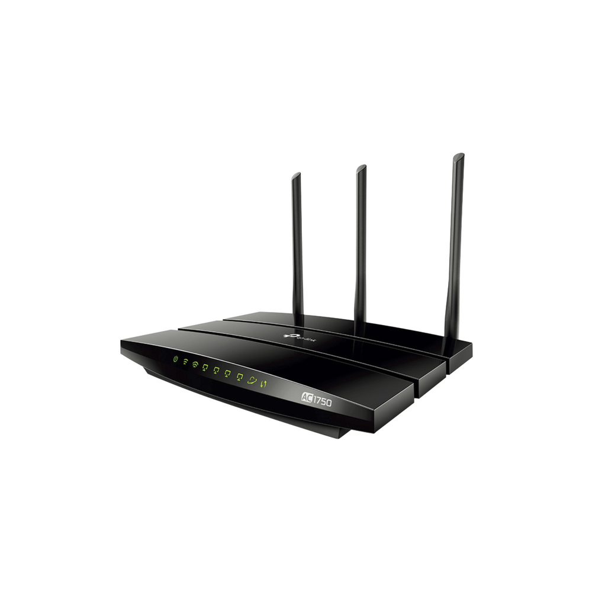
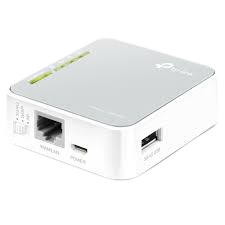

 _______                     ________        __   
|       |.-----.-----.-----.|  |  |  |.----.|  |_ 
|   -   ||  _  |  -__|     ||  |  |  ||   _||   _|
|_______||   __|_____|__|__||________||__|  |____|
         |__|                                     

# Image builder for OpenWRT

# Requirements:

    - docker
    - docker-compose

# Devices

## TP-LINK Archer C7  - [build](./devices/archer-c7/v5/)

    

## TP-LINK TL-MR3020 - [build](./devices/tl-mr3020/v3/)

    

# Building

### The command `maker.sh` build all the images available 

